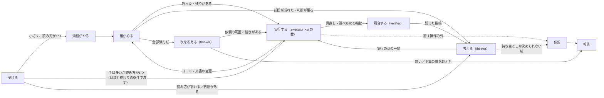

# グラフ（図）

`graph.md` から切り出した（読む合図：「→ 読む：flow.md（図）」）

```mermaid
flowchart LR
  IN["受ける"] -->|"小さく、読み方が1つ"| SELF["頭役がやる"]
  IN -->|"手は多いが読み方が1つ（目標と終わりの条件で渡す）"| EXEC
  IN -->|"読み方が割れる／判断がある"| THINK["考える（thinker）"]
  THINK -->|"実行の点の一覧"| EXEC["実行する（executor ×点の数）"]
  SELF --> CHECK["確かめる"]
  EXEC -->|"コード・文書の変更"| CHECK
  EXEC -->|"見直し・調べものの指摘"| VERIFY["照合する（verifier）"]
  VERIFY -->|"残った指摘"| THINK
  CHECK -->|"通った・残りがある"| EXEC
  CHECK -->|"前提が崩れた・判断が要る"| THINK
  CHECK -->|"全部済んだ"| NEXT["次を考える（thinker）"]
  NEXT -->|"依頼の範囲に続きがある"| EXEC
  NEXT -->|"無い／予算の線を越えた"| OUT["報告"]
  THINK -.->|"持ち主にしか決められない枝"| HOLD["保留"]
  EXEC -.->|"許す操作の外"| HOLD
  HOLD -.-> OUT
```

状態はすべて状態ファイルに書く。点と矢印を通るたびに1行足す。**時刻は `budget.sh` の1行目（いま …）から取る。** 勘で書かない（1時間ずれて書いたことがある）
